# Home Lab: Active Directory + osTicket Help Desk Simulation

## Overview
Built a virtualized IT environment simulating a small business network. The lab includes a Windows Server 2019 domain controller, a Windows 10 client machine, and an Ubuntu Server running osTicket as a help desk ticketing system.

## Technologies Used
- Windows Server 2019 (Domain Controller)
- Active Directory Domain Services
- DNS & DHCP
- Group Policy (GPO)
- Windows 10 Client VM
- Ubuntu Server 22.04
- Apache, MySQL, PHP (LAMP Stack)
- osTicket v1.18.1
- Oracle VirtualBox

## Environment Setup
Three VMs running in VirtualBox: a Windows Server 2019 domain controller, a Windows 10 client, and an Ubuntu Server hosting osTicket. Port forwarding rules configured on the Ubuntu VM to allow SSH (port 2222) and HTTP (port 8080) access from the host machine.

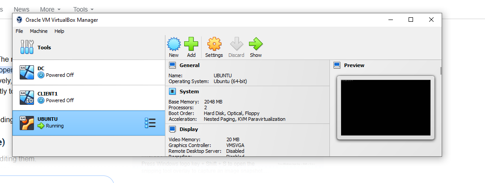
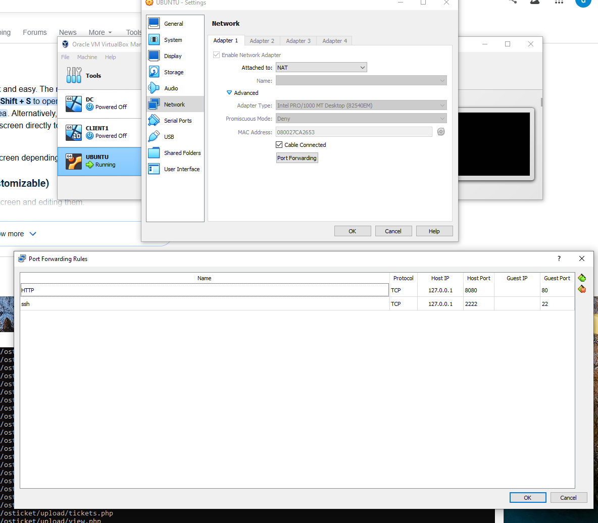

## Active Directory Configuration
- Domain: mydomain.com
- OUs: _USERS, ADMINS, _COMPUTERS, _HR, _IT
- Security Groups: IT-Support, HR-Staff
- Created domain users: jsmith (IT-Support), sjones (HR-Staff)

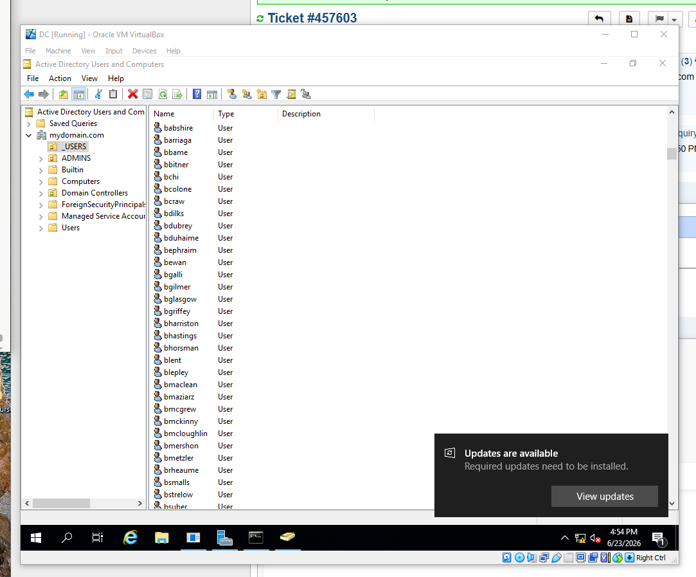
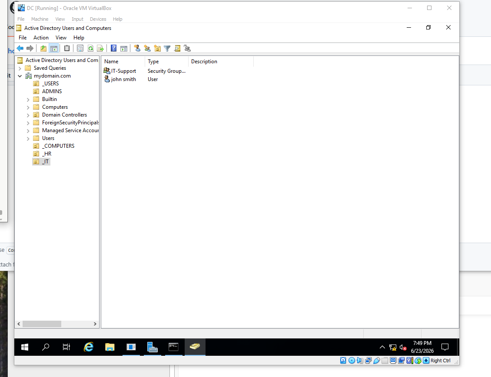
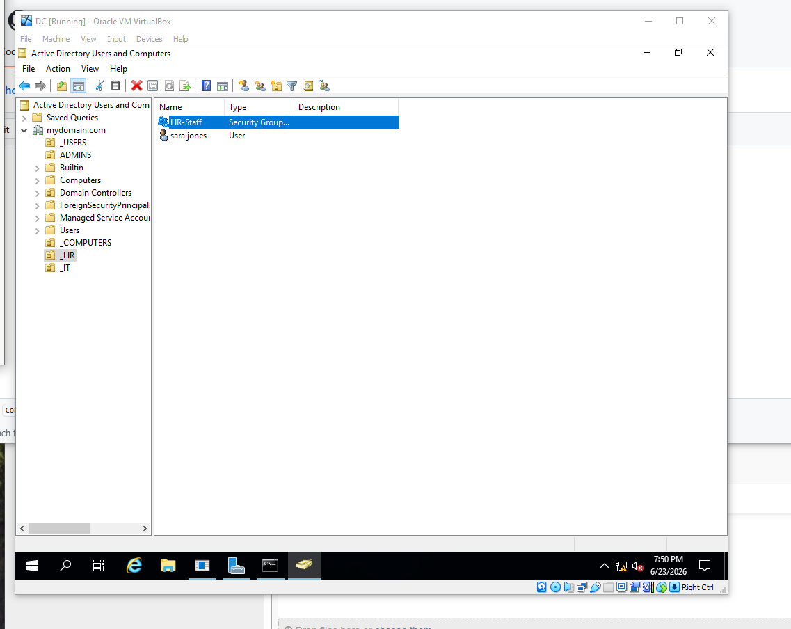
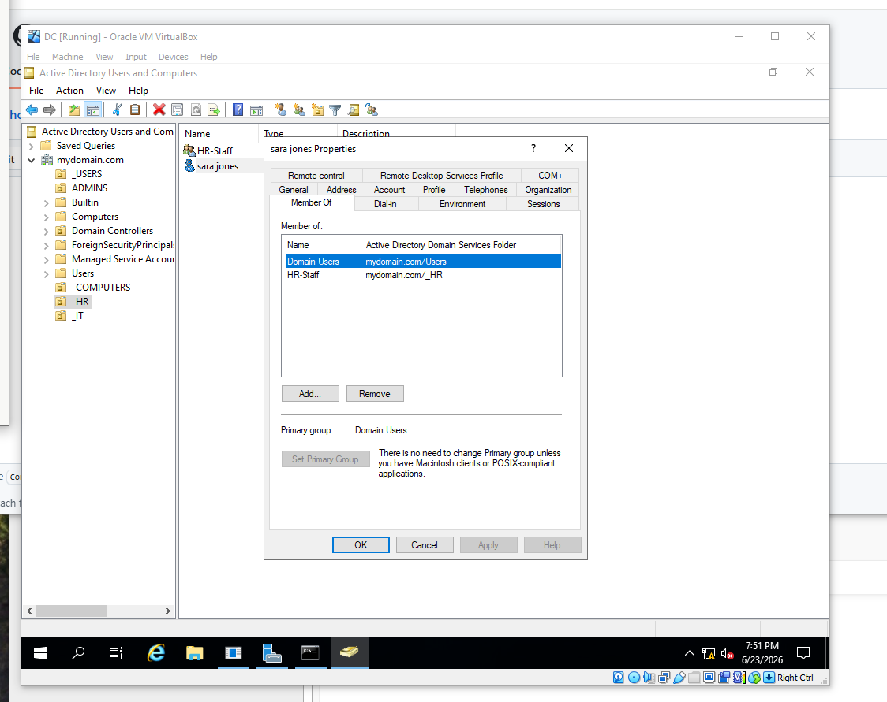

### Creating a Domain User
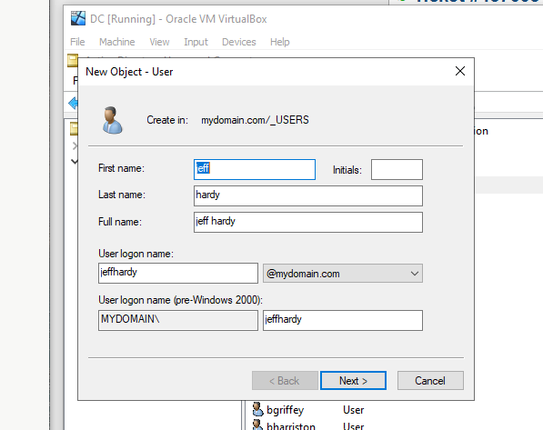
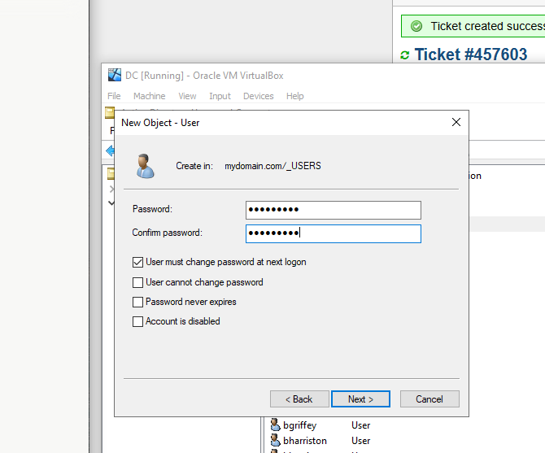
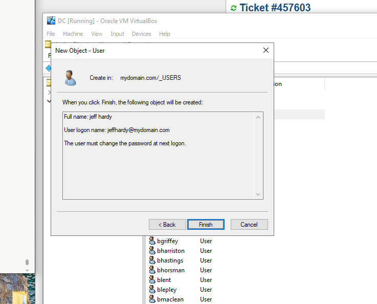

### Password Reset in Active Directory
Simulated a help desk ticket where a user was locked out. Reset performed directly in AD Users and Computers.

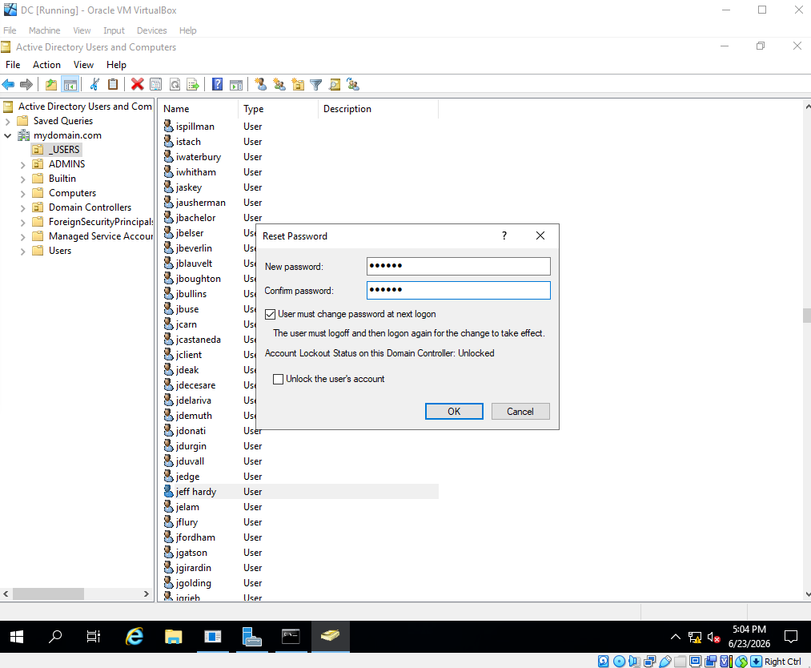

## Group Policy Configuration
Created and linked a GPO (IT-Password-Policy) to the _IT OU enforcing a 12 character minimum password length, complexity requirements, and 90 day maximum password age.

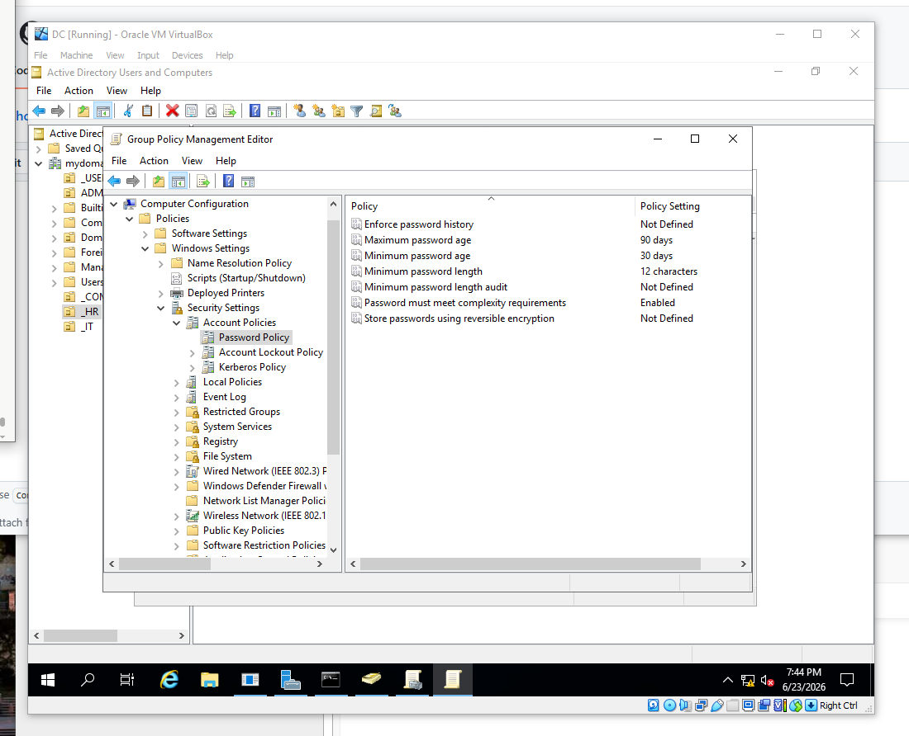

## osTicket Setup
Deployed osTicket on Ubuntu Server via LAMP stack. Configured MySQL database, created agent accounts, and set up departments to simulate a real help desk environment.

### Agents
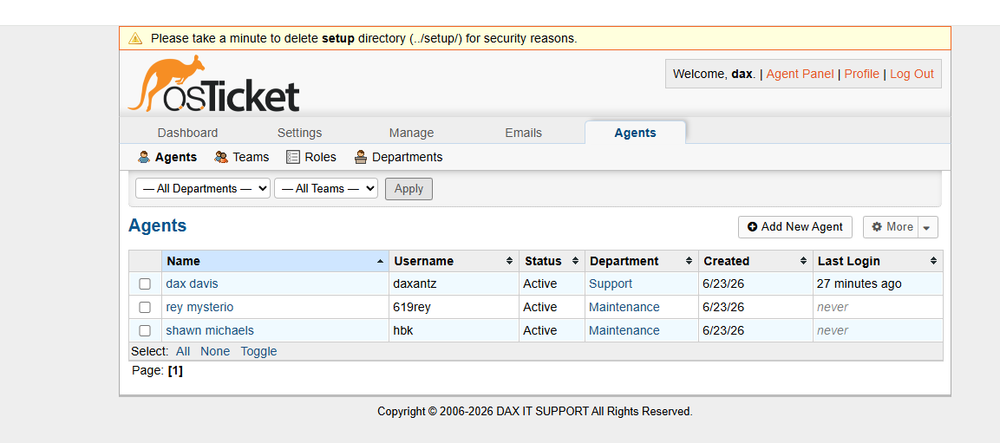

### Departments
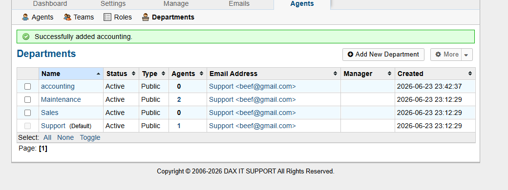

## Ticket Workflow

### Step 1 - User Submits a Ticket
End user submits a ticket reporting they cannot log into their account or need a password reset.

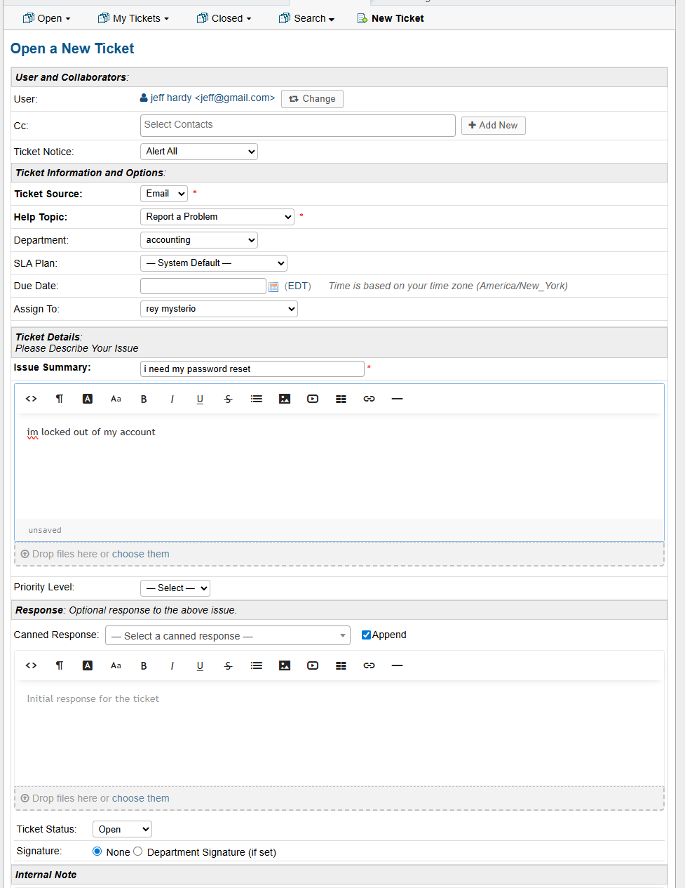

### Step 2 - Agent Views the Queue
Agent logs into the SCP dashboard and sees all open tickets with priority and assignment status.

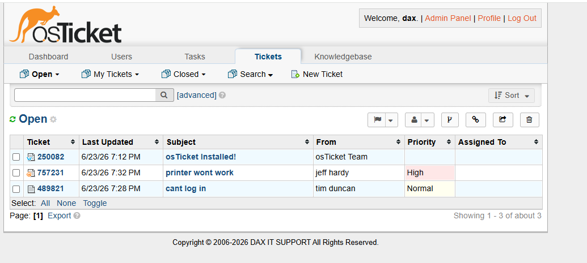
